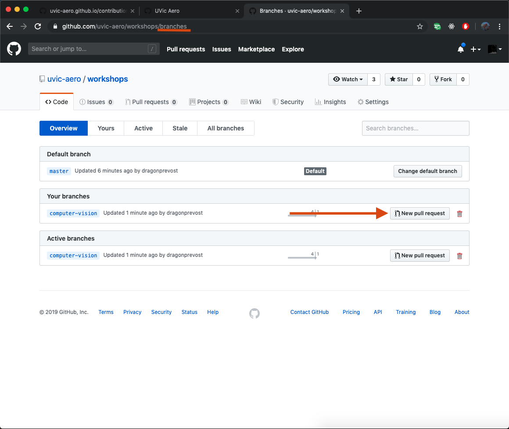
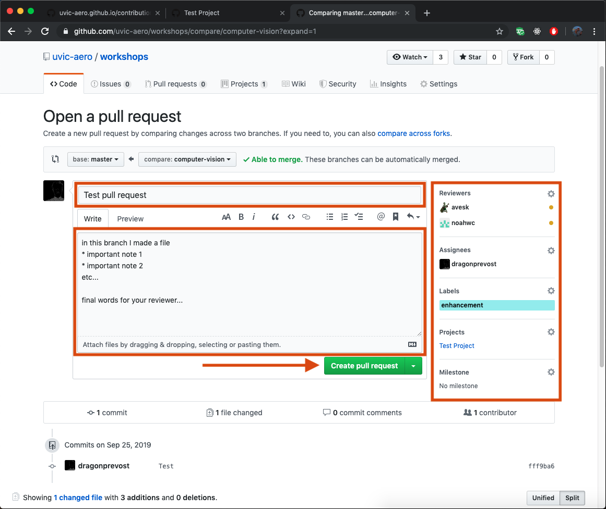

# Contributions

If you are on this page it means you are most likely interested in contributing to a software project in this organization. We are happy to see that you have an interest in our team and that you are helping us build out our systems! In order to stay organized and avoid introducing bugs into our source code we have created a protocol that must be followed by all contributors when modifying the codebase.

## Overview

The Aero software team is adopting a [Kanban](https://help.github.com/en/articles/about-project-boards#templates-for-project-boards), [feature-branch](https://www.atlassian.com/git/tutorials/comparing-workflows/feature-branch-workflow) development workflow. Each repository has a project [Kanban](https://help.github.com/en/articles/about-project-boards#templates-for-project-boards) conisting of github [issues](https://guides.github.com/features/issues/). Issues represent features, bugs, and enhancements and are labelled as such. Each issue is part of a milestone which is defined on the organization level. Feature branches are created for each issue.

The process of contributing can be broken up into these simple steps. Each step is defined in a higher resolution through this document. 

1. [Create or Assign Issue](#issues)
1. [Create Feature Branch](#feature-branch)
1. [Develop Feature Branch](#coding)
1. [Rebase/Merge Feature Branch](#rebase-or-merge)
1. [Create Pull Request](#pull-request)
1. [Code Review (Iterative Process)](#pull-request)
1. [Document Issue](#document)
1. [Merge Feature Branch](#merge)

## Issues
* What are github issues?
A github issue is a task with a detailed description of what must be done in order to complete that task. For Aero each branch that is created will have a corresponding issue. Issues are labelled as either a **feature**, **bug**, or an **enhancement** depending on what label best suites the task description.

* [making a new issue](https://help.github.com/en/articles/creating-an-issue)

* [assigning yourself to an issue](https://help.github.com/en/articles/assigning-issues-and-pull-requests-to-other-github-users)

* [Add issue to the project kanban](https://help.github.com/en/articles/adding-issues-and-pull-requests-to-a-project-board#adding-issues-and-pull-requests-to-a-project-board-from-the-sidebar)
* As shown in the screenshot, this can be done in the projects section within the right sidebar.

* You may also choose to [put your issue in a milestone](https://help.github.com/en/articles/associating-milestones-with-issues-and-pull-requests). However, organizing milestones will usually be planned together as a team :).

## Feature Branch 
* `git checkout -b [feature_branch_name]`

## Coding
* Talk about any coding conventions used in aero ie. obc structure

## Rebase or Merge
Prior to a pull request feature branch must be either
 * rebased onto master
   * `git rebase master`
 * or the master can be merged into the feature branch and then feature branch can be merged into master.
   * `git merge master`
   * `git checkout master`
   * `git merge [feature_branch_name]`

## Pull Request
* [Creating a pull request on github](https://help.github.com/en/desktop/contributing-to-projects/creating-a-pull-request)

* assign reviewers
* Iterative process, show comments and feedback, suggestions etc...

## Document
* While waiting for peer review, document any details related to the new feature that may be valuable for others to be aware of

## Merge
* After the pull request has been approved by at least 2 peers (one owner and one member), merge the branch
  * Show screen shots of merging
